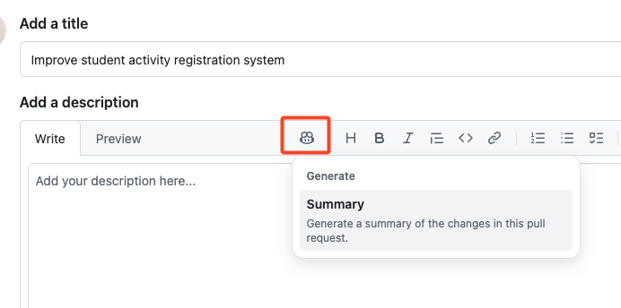

## ステップ5: pull request内でGitHub Copilotを使う

おめでとうございます！このエクササイズのコーディング（とVS Code）が完了しました。今度は作業をマージする時です。 :tada: 締めくくりとして、pull requestを効率化できる2つの限定アクセスCopilot機能について学びましょう！

### 📖 理論: pull requestのためのGitHub Copilot

#### Copilot pull requestサマリー

通常、ノートとコミットメッセージを確認してpull requestの説明としてまとめます。これには時間がかかることがあります。特にコミットメッセージが一貫していなかったり、コードが十分にドキュメント化されていない場合には。幸いなことに、Copilotはpull requestのすべての変更を考慮して重要なハイライトを提供できます。しかも参照付きで！

#### Copilotコードレビュー

作業に多くの目が入るのは常に役立つので、通常のピアレビュープロセスを行う前にCopilotに最初のパスを依頼しましょう。Copilotは簡単な調整で修正できる一般的な間違いを見つけるのが得意ですが、責任を持って使用することを忘れないでください。

> [!NOTE]
> これらの機能は**GitHub Copilot**の有料プランでのみ利用可能です。[[docs]](https://docs.github.com/en/copilot/get-started/plans)

### :keyboard: アクティビティ: CopilotでPRを要約してレビューする

**Copilot pull requestサマリー**と**Copilotコードレビュー**はどちらも限定アクセスなので、このアクティビティはほぼオプションです。アクセスがない場合は、このアクティビティのオプションステップをスキップしてください。

1. ウェブブラウザで別のタブを開き、エクササイズリポジトリに移動します。

1. 新しいpull requestを作成することを提案する**通知バナー**が表示されるかもしれません。それをクリックするか、上部の**Pull Requests**タブを使って**新しいpull requestを作成**します。以下の詳細を使用してください：

   - **base:** `main`
   - **compare:** `accelerate-with-copilot`
   - **title:** `Improve student activity registration system`

1. （オプション）PRの説明ツールバーで**Copilot**アイコンと**Summary**アクションをクリックします。しばらくすると、Copilotがあなたの変更に基づいた説明を追加します。 :memo:

   

1. （オプション）右側の情報パネル上部にある**レビュアー**セクションを見つけ、**Copilotアイコン**の隣にある**リクエスト**ボタンをクリックします。Copilotがあなたのpull requestにレビューコメントを追加するまでしばらく待ちます！

   

   > 💡 **ヒント:** Copilotがレビューのためにリクエストされたログエントリに注目してください。

1. 下部の**pull requestをマージ**ボタンを押します。よくできました！すべて完了です！ :tada:

1. Monaがあなたの作業を確認し、フィードバックを提供して、このエクササイズの最終レビューを投稿するまでしばらく待ちます！
